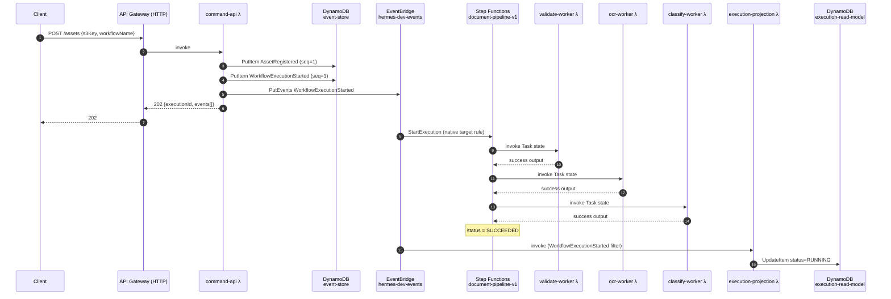
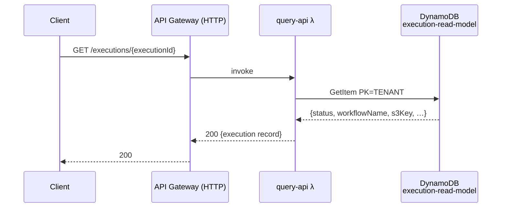
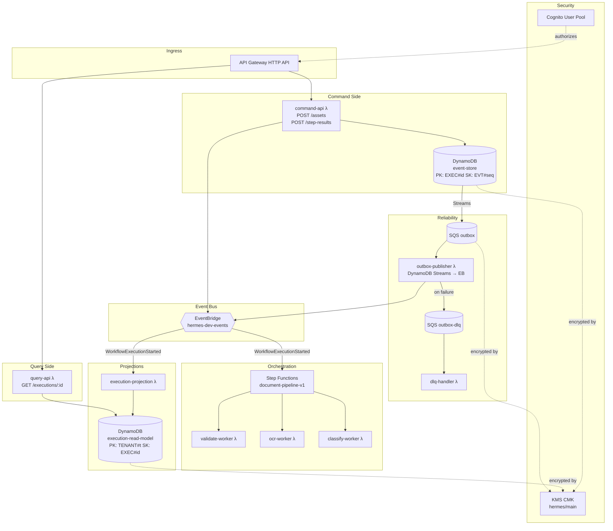

# Hermes — Architecture

Hermes is an **event-sourced, CQRS-based workflow orchestration platform** built entirely on AWS serverless primitives. Commands mutate state by appending domain events to an immutable event store. Queries read from eventually-consistent projections. Workflow execution is delegated to AWS Step Functions, triggered by an EventBridge native integration.

---

## Request Flow — Command Side (`POST /assets`)

---

## Request Flow — Query Side (`GET /executions/{id}`)

---

## Component Map

---

## Service Inventory

| Service | Language | Trigger | Role |
|---|---|---|---|
| `command-api` | TypeScript / Node 20 | API Gateway `POST /assets`, `POST /step-results` | Accept commands, append events to event store, publish to EventBridge |
| `query-api` | TypeScript / Node 20 | API Gateway `GET /executions/{id}` | Read execution state from read model |
| `validate-worker` | TypeScript / Node 20 | Step Functions Task | Validate document; write `StepCompleted` event |
| `ocr-worker` | TypeScript / Node 20 | Step Functions Task | OCR document; write `StepCompleted` event |
| `classify-worker` | TypeScript / Node 20 | Step Functions Task | Classify document; write `StepCompleted` event |
| `execution-projection` | TypeScript / Node 20 | EventBridge rule | Project workflow lifecycle events into `execution-read-model` |
| `outbox-publisher` | TypeScript / Node 20 | SQS (from DynamoDB Streams) | Guaranteed at-least-once delivery of events from event store to EventBridge |
| `dlq-handler` | TypeScript / Node 20 | SQS (DLQ) | Inspect and triage poison messages |
| `snapshot-trigger` | TypeScript / Node 20 | (scheduled / event) | Write aggregate snapshots above threshold |
| `opensearch-projection` | TypeScript / Node 20 | EventBridge rule | Index execution outputs into OpenSearch |
| `usage-projection` | TypeScript / Node 20 | EventBridge rule | Aggregate per-tenant usage metrics |
| `webhook-dispatcher` | TypeScript / Node 20 | EventBridge rule | Deliver outbound webhook notifications on workflow completion |
| `outbox-republisher` | TypeScript / Node 20 | (scheduled) | Replay unpublished outbox events |

---

## AWS Infrastructure

| Resource | Name (dev) | Purpose |
|---|---|---|
| API Gateway HTTP API | `hermes-dev-api` | Ingress — routes to command-api and query-api |
| DynamoDB | `hermes-dev-event-store` | Append-only event store (CMK-encrypted) |
| DynamoDB | `hermes-dev-execution-read-model` | Query-side projection (CMK-encrypted) |
| EventBridge Bus | `hermes-dev-events` | Internal event backbone |
| Step Functions | `hermes-dev-document-pipeline-v1` | Primary workflow state machine |
| Step Functions | `hermes-dev-document-pipeline-v2` | Next-generation pipeline (not yet wired) |
| Step Functions | `hermes-dev-approval-flow-v1` | Human-approval workflow (not yet wired) |
| Step Functions | `hermes-dev-batch-etl-v1` | Batch processing workflow (not yet wired) |
| SQS | `hermes-dev-outbox` | Outbox buffer from DynamoDB Streams |
| SQS | `hermes-dev-outbox-dlq` | Dead-letter queue for failed messages |
| KMS CMK | `hermes/main` | Encrypts DynamoDB tables and SQS queues |
| S3 | `hermes-dev-raw-<account>` | Raw asset storage |
| S3 | `hermes-dev-replay-checkpoints-<account>` | Replay checkpoint storage |
| OpenSearch | `hermes-dev-search` | Full-text search over execution outputs |
| Cognito | `hermes-dev-users` | Auth (wiring to API Gateway deferred) |
| SNS | `hermes-dev-ops-alerts` | Operational alarm notifications |

---

## Key Design Decisions

### Event Sourcing over CRUD
State is never updated in place. Every transition — `AssetRegistered`, `WorkflowExecutionStarted`, `StepCompleted` — is an immutable fact appended to the event store. The current state of any aggregate is a fold over its event stream. This gives free time-travel, audit trail, and replay.

### EventBridge native target (not Lambda glue)
The EventBridge → Step Functions integration uses AWS's native `StepFunctions:StartExecution` target, configured via `eventbridge-sfn-target` Terraform module. No Lambda intermediary. This eliminates a cold-start latency tier and a potential failure point.

### CQRS — reads never touch the event store
`query-api` reads exclusively from `execution-read-model`, a DynamoDB table written by `execution-projection`. The event store table is write-optimised (append-only). Query load does not contend with write load.

### IAM least-privilege + KMS per table
All DynamoDB tables use a customer-managed KMS key. Lambda execution roles hold only the DynamoDB actions they need plus explicit `kms:Decrypt` / `kms:GenerateDataKey` grants. No wildcard `*` actions. The KMS key policy is the backstop.

### Outbox pattern for reliable EventBridge delivery
`command-api` writes events to the event store synchronously and also triggers EventBridge directly. `outbox-publisher` provides a guaranteed at-least-once delivery path via DynamoDB Streams → SQS → Lambda, ensuring no event is silently dropped if EventBridge is transiently unavailable.
