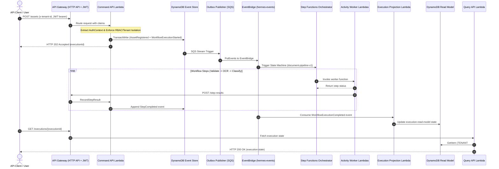

# Hermes — Developer Guide

Welcome to the Hermes Developer Guide! This document explains how the request flow works, how to run local development tasks, and how to debug system components.

---

## Request & Event Flow Diagram



---

## Interactive Developer Script (`scripts/dev.sh`)

Hermes includes a developer shortcut script for local tasks:

```bash
./scripts/dev.sh
```

> **Note:** Option 1 below runs `npm test` only — it does **not** run `npm run build` first, and it does not cover the Java or Python suites. For a first-time run, or after pulling changes to `shared/*`, run `npm run build` manually before using this option. See [`TESTING.md`](TESTING.md) for the complete testing guide.

### Script Options

1. **`1` — Run Unit Tests**: Executes `npm test` (TypeScript workspaces only) across all monorepo workspaces.
2. **`2` — Build & Bundle**: Compiles TypeScript and packages Lambda zips in `infra/.build/`.
3. **`3` — Deploy to AWS**: Uploads zip archives to AWS Lambda in `ap-south-1`.
4. **`4` — Run Smoke Test**: Executes the 8-layer critical path smoke test against live AWS infrastructure.
5. **`5` — Tail CloudWatch Logs**: Streams logs for `command-api`, `execution-projection`, or workers.

---

## Local Debugging Tips

### Tailing Lambda Logs
```bash
aws logs tail /aws/lambda/hermes-dev-command-api --region ap-south-1 --follow
```

### Querying Event Store Directly
```bash
aws dynamodb query \
  --table-name hermes-dev-event-store \
  --region ap-south-1 \
  --key-condition-expression "PK = :pk" \
  --expression-attribute-values '{":pk":{"S":"AGG#WorkflowExecution#<executionId>"}}'
```

### Manually Testing Security Boundaries
```bash
# Tenant Isolation Violation Test
curl -i -X POST "https://<api-id>.execute-api.ap-south-1.amazonaws.com/assets" \
  -H "Content-Type: application/json" \
  -H "x-tenant-id: tenant-alpha" \
  -H "x-role: User" \
  -d '{"s3Key":"test.pdf","tenantId":"tenant-beta"}'
```
Expected output: `HTTP 403 Forbidden` (`TenantIsolationError`).