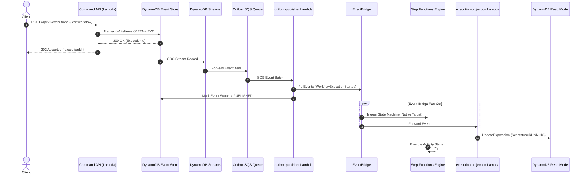
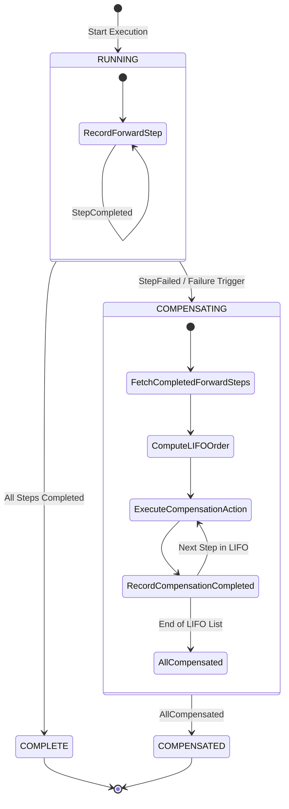
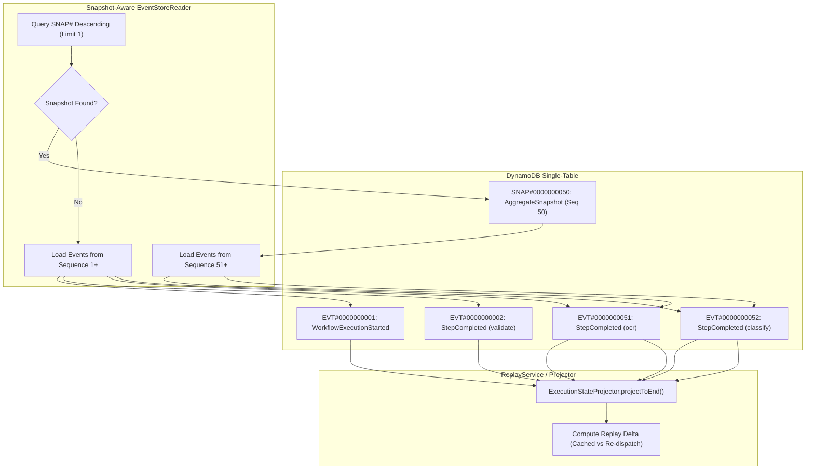

# Hermes Platform  System Diagrams & Visual Models

This document contains Mermaid diagrams visualizing the execution mechanics, event-sourcing outbox pipeline, Saga state machine, and snapshot time-travel engine.

---

## 1. End-to-End Command-to-Projection Architecture Flow

---

## 2. Saga Compensation State Machine

---

## 3. Snapshot Time-Travel History Reconstruction

