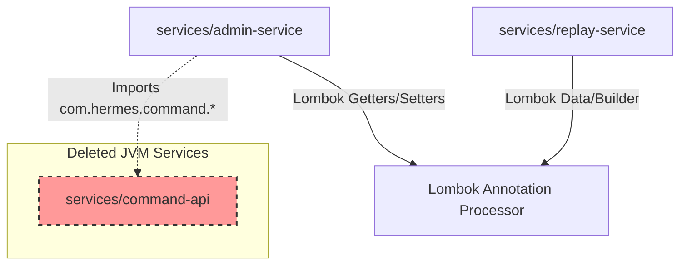

# Hermes Java Build & Upgrade Investigation Report

This report analyzes the build topology, dependencies, compilation errors, and DTO/module wiring inconsistencies in the `hermes` repository following the Java 25 upgrade.

---

## 1. Build Topology

The repository contains two remaining Java API services:
- `services/admin-service`
- `services/replay-service`

### Reactor & Build Setup
- **No Parent Maven Reactor**: There is no root-level `pom.xml` file. The two Java services are completely independent Maven projects.
- **Parent POM**: Both projects inherit from `org.springframework.boot:spring-boot-starter-parent:3.2.4` as their parent POM.
- **Workspaces Integration**: The Java services are not integrated into the root Node.js/TypeScript `package.json` workspaces list, making them isolated from root npm scripts.

### Libraries & Code Generation
- **Annotation Processing**: Lombok is used in both services for boilerplate generation (`@Getter`, `@Setter`, `@Data`, `@Builder`).
- **Code Generation**: No other code generators (MapStruct, Avro, Protobuf, or OpenAPI generators) are used.
- **OpenAPI Integration**: `admin-service` uses hand-written Swagger annotations (`io.swagger.v3.oas.annotations`) for API documentation, but lacks the necessary dependency declaration in its `pom.xml`.

---

## 2. Module Dependency Graph

Since there is no Maven reactor, the projects do not have physical Maven dependencies on each other. However, they share logical dependencies and cross-service package references:

---

## 3. Categorization of Compilation Errors

### Category A: Missing Maven Dependency
- **Swagger/OpenAPI Annotations**: `admin-service`'s `DlqController.java` imports `io.swagger.v3.oas.annotations.Operation` and `io.swagger.v3.oas.annotations.tags.Tag`, but the project `pom.xml` does not declare a dependency on `swagger-annotations` or `springdoc-openapi`.

### Category B: Missing Inter-Module Dependency / Package
- **Missing `com.hermes.command.*`**: `admin-service`'s `DlqController.java` and `VersioningTest.java` import classes from `com.hermes.command` (specifically `DlqInspectionService`, `DlqMessage`, and `EventSchemaUpcaster`). These packages were owned by `services/command-api`, which was deleted during Phase 1 remediation (re-scoping to TypeScript).
- **Missing AWS SQS SDK**: `DlqInspectionService` (which needs to be ported/compiled in `admin-service`) requires `software.amazon.awssdk:sqs` to interact with the Dead-Letter Queue. Neither `admin-service` nor the original `command-api` declared this dependency.

### Category D: Missing Annotation Processing
- **Lombok Methods Not Found**: Across both modules, the compiler throws "cannot find symbol" errors for generated methods such as `setName()`, `getVersion()`, `builder()`, `getExecutionId()`, etc. This occurs because the annotation processor failed to run.

### Category F: Java 25 Incompatibility
- **Lombok JDK 25 Support**: The Lombok version resolved by Spring Boot Starter Parent `3.2.4` is **`1.18.30`**. This version does not support JDK 25 compiler internals (`com.sun.tools.javac`), causing annotation processing to fail silently or crash, which leads directly to the Category D errors. Lombok added JDK 25 support starting in version **`1.18.40`**.

---

## 4. DTO Consistency Verification

The methods referenced by the compiler (`getExecutionId()`, `builder()`, `setStatus()`, `getTenantId()`) on classes `ReplayExecutionRequest`, `ReplayExecutionResponse`, `ActivityDescriptor`, `WorkflowDefinition`, and `Tenant` **should exist**.
They are standard getters, setters, and builders for the fields defined in those classes.
They are missing solely because Lombok `1.18.30` failed to compile under JDK 25 and could not process the Lombok annotations (`@Getter`, `@Setter`, `@Data`, `@Builder`).

---

## 5. Issues Existed Before the Java 25 Migration

The following issues were pre-existing architectural and compilation inconsistencies present in the repository before the upgrade:
1. **Missing Swagger Dependency**: `DlqController.java` was using Swagger annotations, but `admin-service/pom.xml` never declared the dependency.
2. **Missing SQS Dependency**: The DLQ inspection logic relied on SQS, but neither `command-api` nor `admin-service` declared the SQS client dependency.
3. **Broken Wiring (Cross-Service Import)**: `admin-service` imported code from the `com.hermes.command` package directly. Once the Java implementation of `command-api` was deleted in Phase 1 remediation, `admin-service` became immediately uncompilable due to missing files.

---

## 6. Issues Caused by Java 25 Migration

The only issue directly caused by the Java 25 upgrade is the **Lombok incompatibility**:
- Lombok `1.18.30` is incompatible with JDK 25, breaking annotation processing and causing all generated getters, setters, and builders to be missing at compile time.

---

## 7. Ordered Remediation Plan

To restore internal consistency to the JVM services while keeping Phase 1 scope constraints in mind:

### Phase A: Fix Java 25 Upgrade Compatibility (High Priority)
1. **Upgrade Lombok Version**: Override the Lombok version to **`1.18.40`** (or newer) in the `<properties>` section of both `admin-service/pom.xml` and `replay-service/pom.xml`. This fixes Category F and Category D compilation errors.

### Phase B: Repair Module Wiring & Dependencies (Medium Priority)
2. **Add Missing Maven Dependencies**:
   - Add `io.swagger.core.v3:swagger-annotations:2.2.15` (or similar version) to `admin-service/pom.xml` to resolve Category A errors in `DlqController`.
   - Add `software.amazon.awssdk:sqs` to `admin-service/pom.xml` to support the DLQ inspection SQS client.
3. **Port Missing `command-api` Code to `admin-service`**:
   - Move/copy the DLQ inspection class `DlqInspectionService.java` and record `DlqMessage.java` from the baseline commit into `admin-service` under `com.hermes.admin.application` and `com.hermes.admin.domain.dlq`.
   - Port `EventSchemaUpcaster.java` to `admin-service` under `com.hermes.admin.infrastructure.eventstore` (since it is required by the `VersioningTest` test suite).
   - Update imports and package statements in `DlqController.java` and `VersioningTest.java` to point to the new package names, eliminating all cross-service dependency packages and satisfying Category B errors.
