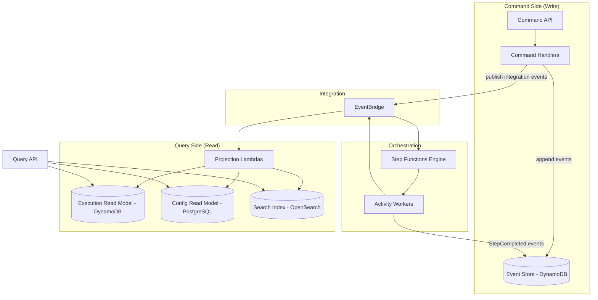
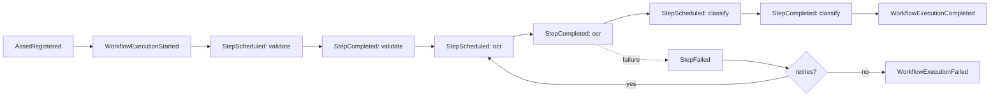

# Hermes — Event-Sourced Workflow Orchestration Platform

### Principal Engineer Design Document (v2)

---

## Reviewer's note

Three deliberate shifts from v1:

- **Hermes is a workflow orchestration platform.** Document processing (OCR → classify → extract → embed → index) is a *built-in workflow template*, not the product definition. The core IP is durable, replayable, multi-tenant workflow execution with event sourcing and CQRS.
- **Event sourcing is the execution truth model.** Every state transition is an append-only domain event. Current state is a projection, never the source of truth. Replay is replaying events, not guessing from logs.
- **CQRS is explicit.** Commands mutate aggregates and append events. Queries hit read models only. No handler both writes DynamoDB and returns a dashboard DTO in the same code path.

Services and patterns without load-bearing justification were removed (see §5 and ADR-011).

---

## 1. Problem Statement

Organizations need to run **configurable, long-running, multi-step processes** — document ingestion pipelines, approval flows, ETL batches, AI enrichment chains — with:

- Durable execution history answerable months later ("what happened to job X?")
- Safe retries without duplicate side effects
- Replay from any step, not just from the start
- Per-tenant isolation and usage attribution
- Zero server operations

Naive Lambda chains fail all of the above. Hermes is an **event-sourced workflow platform**: commands produce events, events drive orchestration, projections serve queries.

**Customer:** B2B tenants who need "define a workflow → trigger it → observe, search, and replay it" as a reliable primitive.

**Built-in workflow templates (not the platform boundary):**

| Template | Steps (illustrative) |
|----------|----------------------|
| `document-pipeline` | validate → OCR → classify → NER → embed → index |
| `approval-flow` | submit → review → approve/deny → notify |
| `batch-etl` | ingest batch → transform → validate → load |

Tenants bind a template (or custom ASL-derived definition) to triggers (upload, schedule, webhook).

---

## 2. Functional Requirements

| ID | Requirement |
|----|-------------|
| F1 | Tenants register orgs, users, roles (Admin, Operator, Viewer) — Phase 2 |
| F2 | Users trigger workflows via API (upload metadata, direct start, schedule) |
| F3 | Workflows are versioned definitions with branching, parallelism, timeouts, retries, human gates |
| F4 | **Any workflow template** can be registered; document-pipeline ships as default |
| F5 | Search over workflow outputs and derived documents — Phase 2 |
| F6 | Replay from any step using event history + cached step outputs |
| F7 | Webhooks on terminal workflow states — Phase 3 |
| F8 | Full audit trail from immutable event log (who, what, which model/prompt version) |
| F9 | Per-tenant usage dashboards — Phase 2 |
| F10 | AI steps route through a gateway; provider swap is config, not deploy — Phase 2 |

---

## 3. Non-Functional Requirements

| Category | Requirement |
|----------|-------------|
| Availability | 99.9% command API; async processing tolerates downstream degradation |
| Scalability | 10 → 50,000 triggers/hour without pre-provisioning |
| Durability | Zero loss for accepted commands; events persisted before side effects |
| Latency | Command API p99 < 300ms (accept + append event + enqueue) |
| Consistency | Strong consistency per aggregate (execution); eventual across read models |
| Multi-tenancy | Hard isolation at event store, projection, and query layers |
| Idempotency | Every activity safely retriable via `(executionId, stepName)` keys |
| Observability | `correlationId` from command through every event and projection |

---

## 4. Architectural Overview: Event Sourcing + CQRS



### 4.1 Command side

- **Command API** accepts intent: `StartWorkflow`, `UploadAsset`, `ReplayExecution`, `RecordStepResult` (from activities).
- **Command handlers** load aggregate from event stream, enforce invariants, append new events, publish to EventBridge.
- **No query logic** in command handlers. No "return current status" from write path except command acceptance ack.

### 4.2 Event store

- Append-only. One table, partition per aggregate (`EXEC#{executionId}`).
- Events: `WorkflowExecutionStarted`, `StepScheduled`, `StepCompleted`, `StepFailed`, `WorkflowCompleted`, `WorkflowFailed`, etc.
- Event envelope: `{ eventId, eventType, eventVersion, aggregateId, tenantId, correlationId, occurredAt, payload }`.

### 4.3 Orchestration

- Step Functions executes the *current* definition version. It is a **process manager**, not the system of record.
- **Workflow kickoff is EventBridge → Step Functions (native target).** When `command-api` publishes `WorkflowExecutionStarted`, an EventBridge rule invokes `states:StartExecution` via an IAM role on the rule — no Lambda glue. See `infra/modules/eventbridge-sfn-target`.
- Activity workers are idempotent; on success they emit `StepCompleted` via command handler.
- SFN state input includes `executionId`, `tenantId`, `workflowVersion`, `replayContext`.

### 4.4 Query side

- **Projection Lambdas** subscribe to EventBridge, update denormalized read models.
- **Query API** serves dashboards, execution detail, search — read models only.
- Rebuild any read model by replaying events from the store (operational requirement, not optional nice-to-have).

---

## 5. Service Boundaries (Trimmed)

| Service | Side | Responsibility | Phase |
|---------|------|----------------|-------|
| **command-api** | Command | Accept commands, dispatch to handlers, return ack + ids | 1 |
| **workflow-engine** | Orchestration | Step Functions definitions, version registry, SFN control plane | 1 |
| **activity-workers** | Orchestration | Single-purpose Lambdas (OCR, classify, …) registered as workflow activities | 1 |
| **event-projections** | Query | Project events → read models | 1 |
| **query-api** | Query | Read-only HTTP API over projections | 1 (minimal) |
| **ai-gateway** | Command/Orchestration | Provider abstraction for AI activities | 2 |
| **auth** | Both | Cognito + org context | 2 |
| **notification-consumer** | Query/Event | Webhook delivery off terminal events | 3 |

**Removed from v1 (no load-bearing justification or merged):**

| Removed | Reason |
|---------|--------|
| `audit-service` | Audit *is* the event store; separate service duplicated truth |
| `billing-service` | Phase 2 projection off `UsageRecorded` events, not a standalone write service |
| `ingestion-service` as separate svc | Merged into `command-api` — upload is a command |
| `search-service` as separate write path | Writes only via projections; query-api reads OpenSearch |
| SNS | EventBridge fan-out with rules; one bus, schema registry |
| SQS between every SFN→Lambda step | SQS only where backpressure is proven necessary (AI rate limits); SFN native integration default |
| Distributed locks | Stretch; not needed until cross-aggregate coordination has a real use case |
| Plugin system | Stretch; activity registry in Postgres replaces speculative plugin API |

---

## 6. Domain Model

### Aggregates

| Aggregate | ID | Commands | Events |
|-----------|-----|----------|--------|
| `WorkflowExecution` | `executionId` | Start, FailStep, CompleteStep, Complete, Fail, Replay | Started, StepScheduled, StepCompleted, StepFailed, Completed, Failed |
| `WorkflowDefinition` | `defId@version` | Publish, Deprecate | DefinitionPublished, DefinitionDeprecated |
| `Asset` | `assetId` | RegisterUpload, MarkProcessed | AssetRegistered, AssetProcessed |

Phase 1 implements `WorkflowExecution` and `Asset` only.

### Built-in workflow: document-pipeline

Registered in `workflows/templates/document-pipeline-v1.json`. Steps map to activities:

```
validate → ocr → classify → [Phase 2: ner → embed → index]
```

Other templates follow the same activity registry pattern.

---

## 7. Storage

| Store | Role | Justification |
|-------|------|---------------|
| **DynamoDB — Event Store** | Append-only domain + integration events | Write throughput, stream for projections, keyed by aggregate |
| **DynamoDB — Execution Read Model** | Current execution snapshot, list-by-tenant queries | Optimized queries; rebuildable from events |
| **PostgreSQL** | Orgs, users, workflow definitions, activity registry, AI config | Relational, transactional config — Phase 2 for full schema; Phase 1 uses local/SQLite or hardcoded defs |
| **OpenSearch** | Search over derived documents | Rebuildable index — Phase 2 |
| **S3** | Raw + processed blobs | Durable object storage |

See ADR-003, ADR-004, ADR-005.

---

## 8. Event Flow (document-pipeline example)



Every box is a persisted event. Projections and SFN react to integration events on the bus.

---

## 9. Replay

1. Operator sends `ReplayExecution { executionId, fromStep }` command.
2. Handler loads event stream, validates `fromStep`, emits `WorkflowExecutionReplayStarted`.
3. Control plane starts new SFN execution with `replayContext.cachedOutputs` populated from prior `StepCompleted` events before `fromStep`.
4. Steps before `fromStep` are skipped in ASL via Choice states; their outputs injected from replay context.

Replay is **event-derived**, not reconstructed from CloudWatch logs.

---

## 10. Failure Handling

| Scenario | Handling |
|----------|----------|
| Duplicate S3 ObjectCreated | Idempotent `AssetRegistered` — same `assetId` → no-op |
| Activity transient failure | SFN Retry + activity idempotency key |
| Activity permanent failure | `StepFailed` event → SFN Catch → `WorkflowExecutionFailed` or branch to DLQ activity |
| Event store write succeeds, bus publish fails | Outbox pattern: event row includes `publishedAt`; projector republishes unpublished events |
| Projection lag | Queries may be eventually consistent; command ack is strong per aggregate |
| Poison file | Fail step, emit event, surface in execution read model; operator replays after fix |

---

## 11. Multi-Tenancy

- `tenantId` on every event and read model row — from JWT, never request body.
- Event store PK scoped: `TENANT#{tenantId}#EXEC#{executionId}`.
- Phase 1: single hardcoded tenant `tenant-dev`.
- Phase 2: Postgres RLS + query-api tenant filter enforcement.

---

## 12. Observability

- `correlationId` = `executionId` for workflow-scoped traces.
- CloudWatch + X-Ray on command and activity paths.
- Operational logs ≠ audit trail. Audit trail = event store.

---

## 13. Deployment

- Environments: dev → staging → prod (separate AWS accounts).
- Terraform modules per environment.
- Workflow definitions and event schemas are versioned artifacts in repo.

---

## 14. Folder Structure

```
hermes/
├── docs/
│   ├── hermes-design.md
│   └── adr/
├── services/
│   ├── command-api/
│   ├── query-api/
│   ├── workflow-engine/
│   ├── activity-workers/
│   │   ├── validate-worker/
│   │   ├── ocr-worker/
│   │   └── classify-worker/
│   └── event-projections/
│       └── execution-projection/
├── shared/
│   ├── domain/                  # aggregates, commands, events
│   ├── event-store/             # append, load stream
│   └── observability/
├── workflows/
│   ├── templates/               # built-in workflow ASL
│   └── activities/              # activity metadata registry
├── infra/
│   ├── modules/
│   └── environments/dev/
└── .github/workflows/
```

---

## 15. Roadmap

### Phase 1 — Core platform (build first)

Event store + command-api + Step Functions engine + document-pipeline template (validate, OCR, classify) + execution projection + minimal query-api. Single tenant. Prove: event append → orchestration → activity → event → projection. Chaos: duplicate delivery, activity retry, replay from classify.

### Phase 2 — Multi-tenancy, AI, search

Auth, Postgres config, AI gateway activity, ner/embed/index steps, OpenSearch projection, usage projection.

### Phase 3 — Production hardening

Webhooks, human-in-the-loop, bulk batching, outbox republisher, load/chaos suite, blue/green.

### Phase 4 — Stretch

Visual workflow builder (emits ASL JSON), custom activity SDK — only when pulled by requirement.

---

## 16. Architecture Decision Records

| ADR | Title |
|-----|-------|
| [ADR-001](adr/001-event-sourcing-for-execution-state.md) | Event sourcing for execution state |
| [ADR-002](adr/002-cqrs-command-query-separation.md) | CQRS command/query separation |
| [ADR-003](adr/003-dynamodb-event-store.md) | DynamoDB as event store |
| [ADR-004](adr/004-postgres-for-configuration.md) | PostgreSQL for configuration |
| [ADR-005](adr/005-opensearch-as-derived-index.md) | OpenSearch as derived search index |
| [ADR-006](adr/006-step-functions-as-process-manager.md) | Step Functions as process manager |
| [ADR-007](adr/007-eventbridge-integration-backbone.md) | EventBridge as integration backbone |
| [ADR-008](adr/008-idempotency-at-activity-boundary.md) | Idempotency at activity boundary |
| [ADR-009](adr/009-workflow-definition-versioning.md) | Workflow definition versioning |
| [ADR-010](adr/010-platform-not-vertical.md) | Platform scope, not vertical doc processor |
| [ADR-011](adr/011-removed-components.md) | Removed components and why |
| [ADR-012](adr/012-outbox-for-reliable-publish.md) | Outbox for reliable event publish |
| [ADR-013](adr/013-nodejs-typescript-lambda-runtime.md) | Node.js/TypeScript Lambda runtime (not Java/Spring Boot) |
