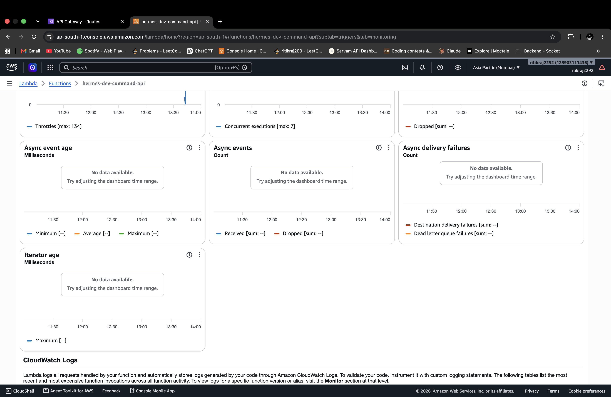
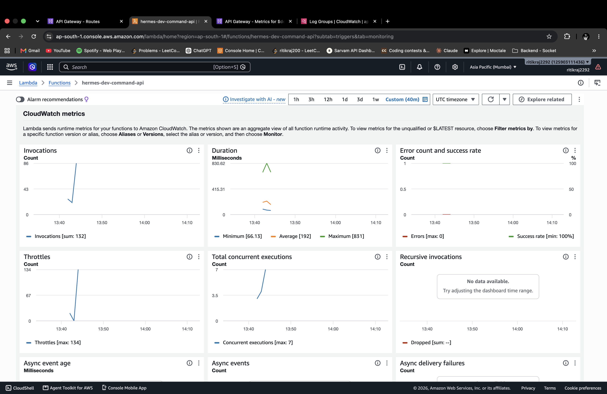
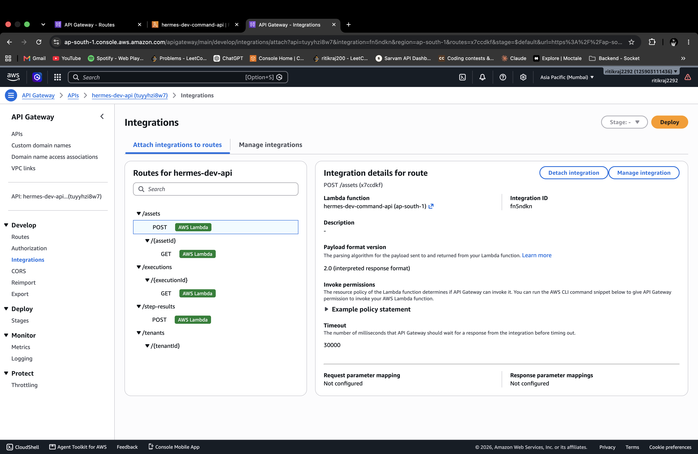
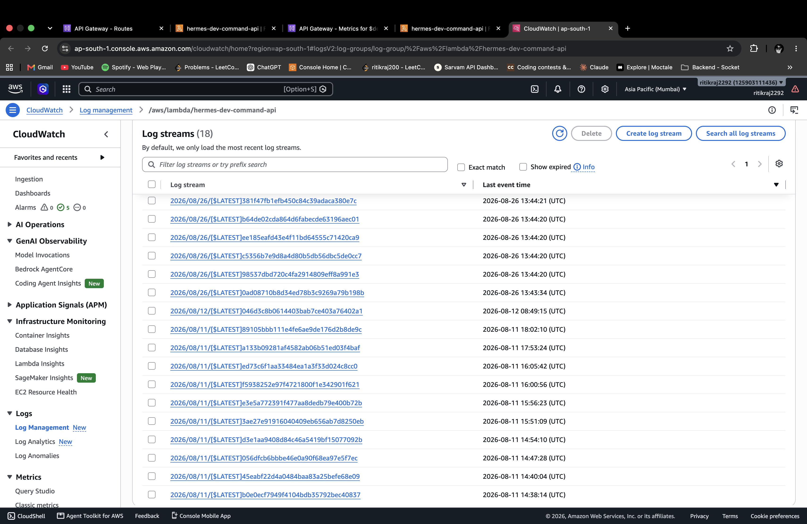

# Hermes Load Testing Report

## 1. Objective & Scope

This document provides the empirical performance evaluation observed during the Hermes non-production load test in AWS region `ap-south-1`.

> [!IMPORTANT]
> **HTTP Request Acceptance vs. Downstream Workflow Completion Boundary**:  
> The load-test harness measures synchronous `POST /assets` request acceptance and ingestion latency at the API Gateway / Lambda boundary. It does **not** measure:
> - AWS Step Functions workflow completion latency
> - Downstream activity worker execution completion
> - CQRS read-model projection latency
> - End-to-end event-sourced workflow execution time
>
> The measured latency percentiles ($p50, p90, p95, p99$) strictly represent synchronous API acceptance latency.

---

## 2. Environment

| Parameter | Observed Value |
|---|---|
| **Cloud Provider** | Amazon Web Services (AWS) |
| **AWS Region** | `ap-south-1` (Mumbai) |
| **Environment Tier** | `dev` (`hermes-dev-*`) |
| **Target API Endpoint** | `POST /assets` (Amazon API Gateway HTTP API) |
| **Compute Runtime** | AWS Lambda (`hermes-dev-command-api`, Node.js 20.x, 256 MB memory) |
| **Data Store** | Amazon DynamoDB (`hermes-dev-event-store`, On-Demand Capacity) |
| **Security / Header** | `x-tenant-id: tenant-load-test`, `x-role: User` |
| **Execution Timestamp** | 2026-08-26 13:42 - 13:44 UTC |

---

## 3. Methodology

Load was generated using the repository's native TypeScript load harness (`scripts/load-test.ts`) executed via Node.js:

- **Client Concurrency**: Worker pool architecture dispatching simultaneous asynchronous HTTP `fetch` requests with sub-millisecond precision timers (`performance.now()`).
- **Safety Safeguards**: Automated circuit breaker configured to abort if error rates exceed $50\%$ over 20 consecutive requests; hard concurrency cap at 50 workers.
- **Profiles Evaluated**:
  - **Smoke Profile**: $c=2$ concurrent workers, 20 total requests.
  - **Baseline Profile**: $c=10$ concurrent workers, 200 total requests.
  - **Stress Profile**: $c=25$ concurrent workers, 1,000 total requests (stopped per safety protocol due to baseline degradation).

---

## 4. Measured Performance Results

### Empirical Benchmark Summary

| Profile | Status | Requests | Concurrency | Duration | RPS | p50 | p90 | p95 | p99 | Error Rate |
|---|---|---:|---:|---:|---:|---:|---:|---:|---:|---:|
| **Smoke** | **EXECUTED — DEGRADED** | 20 | 2 | 2.173 s | 9.21 | 153.55 ms | 457.66 ms | 577.89 ms | 592.93 ms | 10.0% |
| **Baseline** | **EXECUTED — DEGRADED** | 200 | 10 | 3.793 s | 52.74 | 38.97 ms | 228.83 ms | 501.20 ms | 1460.77 ms | 66.0% |
| **Stress** | **NOT EXECUTED — SAFETY STOP** | 1,000 target | 25 target | — | — | — | — | — | — | — |

*Note: The figures above reflect observed results during this specific non-production test and do not represent guaranteed production capacity.*

---

## 5. HTTP Status Code & Error Analysis

### Smoke Profile Distribution (20 Requests)
- **HTTP 202 Accepted**: 18 requests (90.0%)
- **HTTP 503 Service Unavailable**: 2 requests (10.0%)
- **HTTP 500 Application Errors**: 0 requests (0.0%)

### Baseline Profile Distribution (200 Requests)
- **HTTP 202 Accepted**: 68 requests (34.0%)
- **HTTP 503 Service Unavailable**: 132 requests (66.0%)
- **HTTP 500 Application Errors**: 0 requests (0.0%)

---

## 6. AWS Observability Correlation & CloudWatch Reconciliation

CloudWatch monitoring displays and metrics captured during the non-production load test period revealed:

1. **Observed CloudWatch Metrics**:
   - `AWS/Lambda/Errors` for `hermes-dev-command-api` remained at **0.0** during the execution window.
   - `AWS/Lambda/Throttles` graph displays throttle spikes on `hermes-dev-command-api` during burst execution:

   

   - `AWS/Lambda/Invocations` and runtime duration metrics across the non-production load test run:

   

   - `POST /assets` HTTP API Gateway route mapping to `hermes-dev-command-api`:

   

   - 18 active Lambda execution container log streams on `2026/08/26`:

   

2. **Reconciliation Statement**:
   > [!NOTE]
   > CloudWatch invocation count does not directly reconcile with API request count from the load-test harness; the available evidence is insufficient to establish a one-to-one relationship.
3. **Observed Latency on Successful Requests**:
   - For non-throttled invocations during the baseline run, median round-trip response time was **38.97 ms** (minimum **31.90 ms**).

---

## 7. Operational Limitations & Production Architecture Recommendations

1. **Development Environment Boundary**: These tests were executed against the unreserved Hermes `dev` tier in `ap-south-1`. This environment does not have provisioned concurrency or dedicated account-level quota reservations.
2. **Production Recommendations**:
   - **Provisioned Concurrency**: Configure AWS Lambda provisioned concurrency on production command API handlers to eliminate cold starts and burst throttling.
   - **API Gateway Throttling / Usage Plans**: Implement token bucket rate limiting on API Gateway ($100\text{ RPS}$ rate with $200\text{ RPS}$ burst) to shape traffic before hitting compute concurrency limits.
   - **DynamoDB Capacity**: Maintain on-demand capacity mode or provision dedicated WCUs with auto-scaling for predictable multi-thousand RPS ingestion workloads.

---

## 8. Evidence Artifacts & Reproduction

- **Terminal Screenshot Status**: Original terminal screenshot was not captured during the live execution; measured results are preserved in `LOAD_TEST.md` from the completed execution.
- **AWS Console Evidence**: Primary observability screenshots are indexed in [`evidence/README.md`](evidence/README.md).
- **Reproduction Commands**:
  ```bash
  # 1. Export the API Gateway URL from Terraform
  cd infra/environments/dev
  export BASE_URL="$(terraform output -raw api_invoke_url | sed 's|/$||')"
  cd ../../..

  # 2. Run Smoke Profile (20 requests, concurrency 2)
  export PROFILE=smoke
  node --import tsx scripts/load-test.ts --yes

  # 3. Run Baseline Profile (200 requests, concurrency 10)
  export PROFILE=baseline
  node --import tsx scripts/load-test.ts --yes
  ```
