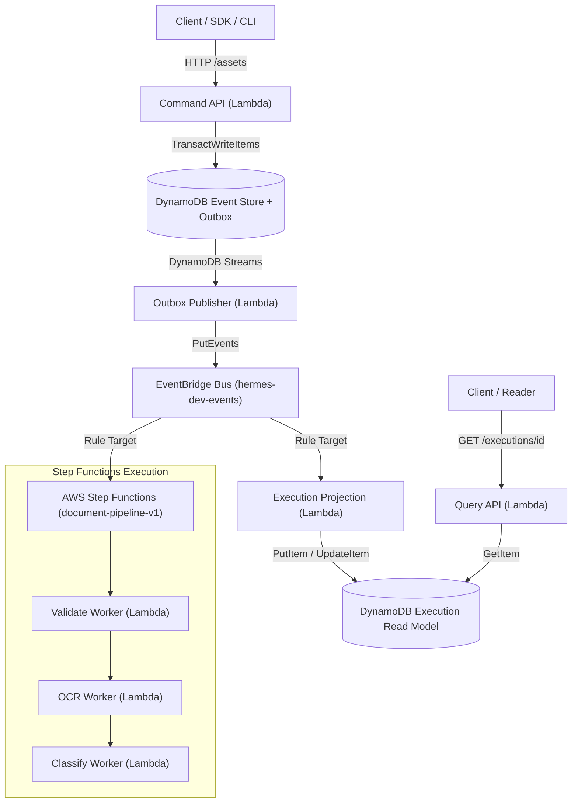

# Hermes — Comprehensive Test Plan & Verification Strategy

**Version:** 1.0.0  
**Target Environment:** AWS (`ap-south-1`)  
**Scope:** Event-Sourced Workflow Orchestration Platform across TypeScript, Java, Python, and Terraform Infrastructure  

---

## 1. Testing Objectives

The primary objective of the Hermes verification strategy is to provide empirical, reproducible proof that the event-driven workflow engine guarantees:

1. **Transactional Outbox & Dual-Write Prevention**: $O(1)$ atomic persistence to DynamoDB with outbox messages published reliably without distributed 2PC overhead.
2. **Deterministic Event Sourcing & Aggregate Consistency**: Optimistic concurrency control (OCC) preventing split-brain sequence forks under high concurrency.
3. **CQRS Projection Eventual Consistency**: Asynchronous read-model projection guarantees with zero loss across execution, audit, tenant, metrics, and workflow models.
4. **Idempotent Activity Execution & Saga Compensation**: Exactly-once processing semantics at worker boundaries and reliable backward compensation upon unrecoverable failure.
5. **Multi-Tenant Security & RBAC**: Strict tenant isolation across table partitions and role enforcement (`Admin`, `User`, `Service`) on API boundaries.
6. **Infrastructure As Code Reproducibility**: 100% syntactically and semantically valid Terraform modules across environments (`dev` and `staging`).

---

## 2. System Under Test (SUT)

The system comprises 13 implemented AWS Lambda services (with 12 functions visible in the initial console viewport capture), 6 DynamoDB tables, 1 EventBridge custom bus with archive, 2 SQS queues (outbox + DLQ), Step Functions state machines, 2 Java Spring Boot services (`admin-service`, `replay-service`), and 1 Python AI worker service (`services/ai-workers`).

---

## 3. Test Environments

| Environment | Purpose | Infrastructure Stack | Backing Store |
|---|---|---|---|
| **Local Unit / In-Memory** | Rapid developer feedback, property tests, concurrency loops | Local Node.js 20+, Java 25, Python 3.13 | Mock DynamoDB document client, in-memory event queues |
| **LocalStack Emulation** | Local integration testing of DynamoDB Streams, SQS, and EventBridge | Docker Compose (`docker-compose.localstack.yml`) | Emulated AWS services on `localhost:4566` |
| **AWS Dev (`ap-south-1`)** | Live cloud functional verification, smoke testing, and empirical evidence capture | Serverless AWS stack managed by Terraform (`infra/environments/dev`) | Live DynamoDB On-Demand, SQS, EventBridge, CloudWatch |
| **AWS Staging (`ap-south-1`)** | Pre-production validation, load testing, disaster recovery verification | Isolated staging environment (`infra/environments/staging`) | Multi-AZ live AWS infrastructure |

---

## 4. Functional Testing

Functional testing validates domain invariants, aggregate behavior, command handling, and query resolution:

- **Command API Handlers**: Validates request parsing, header extraction (`x-tenant-id`, `x-role`), input schema verification, and 202 Accepted response formatting.
- **Query API Handlers**: Verifies fast $O(1)$ read-model lookups for execution details, workflow definitions, tenant metadata, and metrics.
- **Domain Aggregates (`ExecutionAggregate`, `AssetAggregate`)**: Verifies state mutation rules (e.g., cannot start an already running workflow, cannot complete a cancelled step).
- **Property-Based Testing**: Utilizes `fast-check` in `shared/domain/src/property.test.ts` to generate 100+ pseudorandom event streams and verify aggregate invariants hold under arbitrary sequence variations.

---

## 5. Integration Testing

Integration testing exercises interactions between adjacent components:

- **Command Handlers → Event Store**: Verifies that submitting an `AssetRegistered` command atomically persists both the domain event and outbox record in a single DynamoDB transaction.
- **Outbox Publisher → EventBridge**: Verifies that SQS/DynamoDB Stream records trigger event publishing to `hermes-dev-events` and handle batching.
- **Activity Runners → Step Functions Context**: Tests that activity workers (`validate-worker`, `ocr-worker`, `classify-worker`) correctly parse Step Functions task tokens, context payloads, and return expected output structures.
- **Projections → Read Models**: Verifies that `execution-projection`, `audit-projection`, and `usage-projection` transform raw events into optimized single-table query items.

---

## 6. Contract Testing & Schema Evolution

Hermes enforces strict backward and forward compatibility for event schemas:

- **Schema Validation**: Event payloads are validated against JSON Schemas located in `shared/event-schemas/`.
- **Event Upcasting Pipeline**: Verifies zero-downtime evolution (e.g., `WorkflowExecutionStarted` v1 → v2) by running the upcaster transformer during replay and projection ingestion.
- **Compatibility Matrix**: Contract tests in `shared/event-schemas/event-schemas.test.ts` assert that older payloads can be deserialized by current handlers without runtime exceptions.

---

## 7. Infrastructure-as-Code Validation

Infrastructure is strictly managed via Terraform modules:

- **Static Analysis**: `terraform validate` executes across all 18 submodules (`infra/modules/*`) and root environments (`dev`, `staging`).
- **Module Coverage**: Validates SQS DLQs, DynamoDB tables with PITR (Point-In-Time Recovery), KMS customer managed keys, EventBridge archive retention rules, IAM least-privilege policies, and CloudWatch alarm thresholds.
- **Automated Validation Script**: `./scripts/terraform-validate.sh` ensures every submodule can be initialized and validated independently.

---

## 8. End-to-End Testing

The critical path is validated via automated end-to-end suites:

- **Critical Path Smoke Test (`scripts/smoke-test.sh`)**:
  1. Issues `POST /assets` to API Gateway.
  2. Asserts HTTP 202 and receives `executionId`.
  3. Verifies event publication into DynamoDB Event Store.
  4. Polls AWS Step Functions until `document-pipeline-v1` reaches `SUCCEEDED`.
  5. Scans DynamoDB `execution-read-model` for projected terminal status.
  6. Queries `GET /executions/{id}` through Query API to verify read-model round-trip.
  7. Checks SQS Outbox DLQ `ApproximateNumberOfMessages` equals 0.

---

## 9. Failure & Saga Compensation Testing

Distributed workflow resilience is tested against synthetic faults:

- **Retry Policies**: State machine ASL definitions configure exponential backoff (e.g., interval $2\text{s}$, rate $2.0$, max attempts $3$) for transient worker errors.
- **Non-Retryable Errors**: Hard failures immediately route to ASL `Catch` blocks.
- **Backward Compensation (Saga Pattern)**: Unrecoverable failures trigger compensating transactions (e.g., `CompensateClassification`, `CompensateOCR`) to revert partial state and record `WorkflowExecutionFailed`.

---

## 10. Replay & Time Travel Testing

The Java Spring Boot `replay-service` (`services/replay-service`) provides deterministic state reconstruction:

- **Snapshot-Aware Loading**: Replays from the latest aggregate snapshot (e.g., snapshot at seq 10 + delta events 11–15) to minimize DynamoDB read costs.
- **Point-in-Time Replay**: Reconstructs execution aggregate state at any historical sequence number or timestamp.
- **Replay Forking**: Generates a new linked execution ID while preserving the immutable historical audit trail.

---

## 11. Dead Letter Queue (DLQ) & Poison Pill Handling

- **Outbox DLQ (`hermes-dev-outbox-dlq`)**: Max receive count is set to 3. Unprocessable outbox items automatically dead-letter to avoid blocking the queue.
- **Worker DLQ Handler (`services/lambda-workers/dlq-handler`)**: Consumes DLQ events, extracts error context, logs structured error details, and emits a custom CloudWatch metric (`DLQMessagesReceived`).
- **Republisher**: `outbox-republisher` scans for stale un-published outbox records older than $5\text{ minutes}$ and re-enqueues them.

---

## 12. Observability & Telemetry Testing

- **Structured JSON Logging**: `@hermes/observability` standardizes log outputs with `level`, `service`, `message`, `timestamp`, `traceId`, and `executionId`.
- **CloudWatch Dashboards**: `hermes-dev-observability-dashboard` aggregates API request rates, Step Function execution success/failure ratios, and Lambda durations.
- **CloudWatch Alarms**: Configured alarms monitor DLQ visible message count $>0$, Lambda error rate $>1\%$, and Step Functions failed executions.

---

## 13. Load & Performance Testing

- **Safety-First Load Harness**: Node.js/TypeScript harness (`scripts/load-test.ts`) and k6 script (`benchmarks/k6/load-test.js`) test API throughput without overloading cloud dependencies.
- **Test Profiles**:
  - `smoke`: Concurrency 2, 20 requests.
  - `baseline`: Concurrency 10, 200 requests.
  - `stress`: Concurrency 25, 1000 requests.
- **Empirical SLA Targets**:
  - Ingestion `POST /assets` p95 $< 300\text{ms}$, p99 $< 500\text{ms}$.
  - Read Model `GET /executions/{id}` p99 $< 50\text{ms}$.
  - 5xx Error Rate $< 0.1\%$.

---

## 14. Security & Tenant Isolation Validation

- **Tenant Boundary Enforcement**: Every command handler extracts `x-tenant-id` from JWT claims or headers. Cross-tenant access attempts throw `TenantIsolationError`.
- **Role-Based Access Control (RBAC)**: Enforces `Admin`, `User`, and `Service` role permissions on API endpoints.
- **IAM Least Privilege**: Each Lambda execution role is scoped strictly to its required DynamoDB table, SQS queue ARN, and KMS key ARN.

---

## 15. Test Evidence Policy

1. **Strict Empirical Verification**: Only tests that have been executed and verified against actual repository code or live AWS resources are marked as `PASS`.
2. **Pending Tests**: Any test scenario or load profile that has not yet been executed against live infrastructure is explicitly marked as `PENDING EXECUTION`.
3. **Artifact Provenance**: All screenshot artifacts are cataloged in `evidence/README.md` with source traceability.
