# Local Development & Infrastructure Setup Evidence (`dev/temp/test-01`)

This directory documents the initial local development environment setup, Terraform bootstrapping, dependency resolution troubleshooting, and the end-to-end infrastructure provisioning sequence for the Hermes platform.

---

## 1. Overview & Setup Objectives

- **Environment**: Local Development Machine & AWS Dev (`ap-south-1`)
- **Infrastructure Scope**: Provisioning of the full Hermes serverless stack via Terraform (`infra/environments/dev`)
- **Evidence Type**: Terminal execution screenshots capturing toolchain configuration, installation debugging, and progressive resource provisioning

---

## 2. Evidence Index & Chronological Sequence

| Sequence | Artifact | Filename | Description |
|:---:|---|---|---|
| 01 | **Terraform Tooling Setup** | [`terraform-setup-installation.png`](./terraform-setup-installation.png) | Initial workspace configuration and Terraform CLI initialization. |
| 02 | **Provider Resolution Debugging** | [`terraform-setup-installation-failure-1.png`](./terraform-setup-installation-failure-1.png) | Local provider plugin / lockfile resolution error captured during early setup. |
| 03 | **Successful Initialization** | [`terraform-setup-installation-success.png`](./terraform-setup-installation-success.png) | Successful `terraform init` resolving AWS providers across all 18 modules. |
| 04 | **Apply: Plan & Dependency Graph** | [`terraform-apply-01.png`](./terraform-apply-01.png) | Execution plan initialization and resource dependency graph evaluation. |
| 05 | **Apply: Security & KMS** | [`terraform-apply-02.png`](./terraform-apply-02.png) | IAM execution roles, KMS Customer Managed Keys, and security policies creation. |
| 06 | **Apply: Persistence Layer** | [`terraform-apply-03.png`](./terraform-apply-03.png) | DynamoDB event store, execution read model, and registry tables creation. |
| 07 | **Apply: Messaging & Buffering** | [`terraform-apply-04.png`](./terraform-apply-04.png) | SQS transactional outbox queue and Dead Letter Queue (DLQ) provisioning. |
| 08 | **Apply: Event Routing** | [`terraform-apply-05.png`](./terraform-apply-05.png) | EventBridge custom event bus, 90-day archive, and event routing rules. |
| 09 | **Apply: Microservices & Lambdas** | [`terraform-apply-06.png`](./terraform-apply-06.png) | AWS Lambda microservice functions (command/query APIs, projections, workers). |
| 10 | **Apply: API Gateway & Auth** | [`terraform-apply-07.png`](./terraform-apply-07.png) | HTTP API Gateway, CORS policies, and Cognito JWT Authorizer integration. |
| 11 | **Apply: Workflow Orchestration** | [`terraform-apply-08.png`](./terraform-apply-08.png) | AWS Step Functions state machine (`document-pipeline-v1`) deployment. |
| 12 | **Apply: Derived Indexing** | [`terraform-apply-09.png`](./terraform-apply-09.png) | Amazon OpenSearch Service domain and security group attachment. |
| 13 | **Apply: Observability Stack** | [`terraform-apply-10.png`](./terraform-apply-10.png) | CloudWatch operational dashboard and metric alarm threshold creation. |
| 14 | **Apply: Completion & Outputs** | [`terraform-apply-11.png`](./terraform-apply-11.png) | Final successful `Apply complete!` output and exported endpoint URLs. |

---

## 3. Visual Setup Walkthrough

### Part 1: Local Toolchain & Provider Setup

#### 1. Initial Setup Attempt
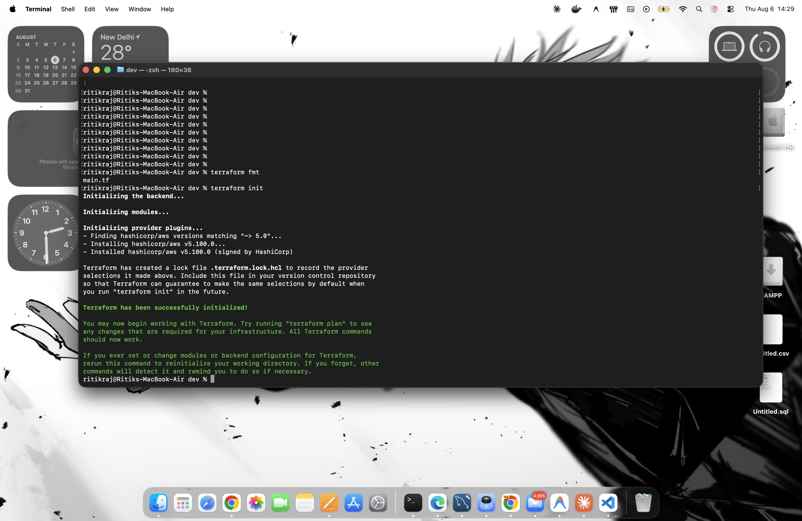

#### 2. Provider Resolution Troubleshooting
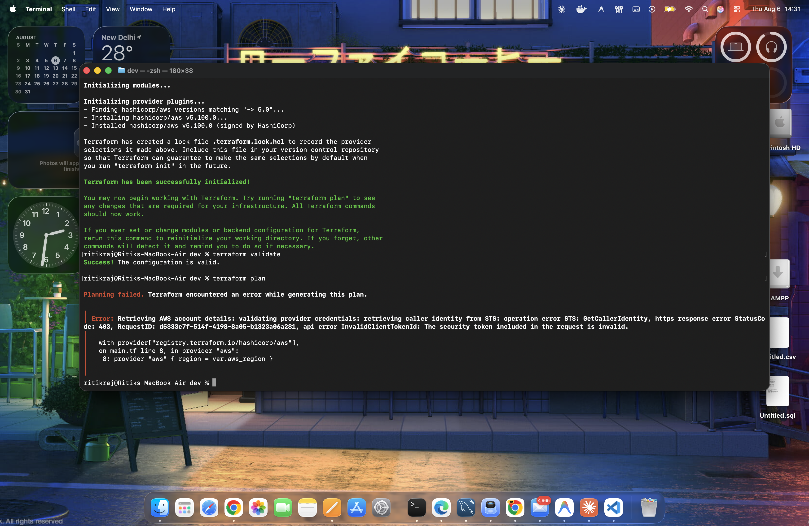

#### 3. Successful Provider Resolution & Init
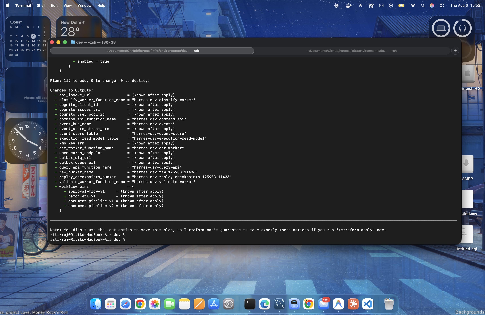

---

### Part 2: Progressive Infrastructure Provisioning (`terraform apply`)

#### 1. Plan Initialization & Resource Graph
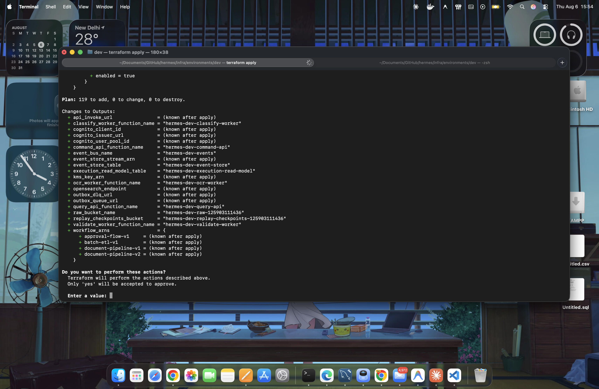

#### 2. IAM Roles, KMS Key & Security Policies
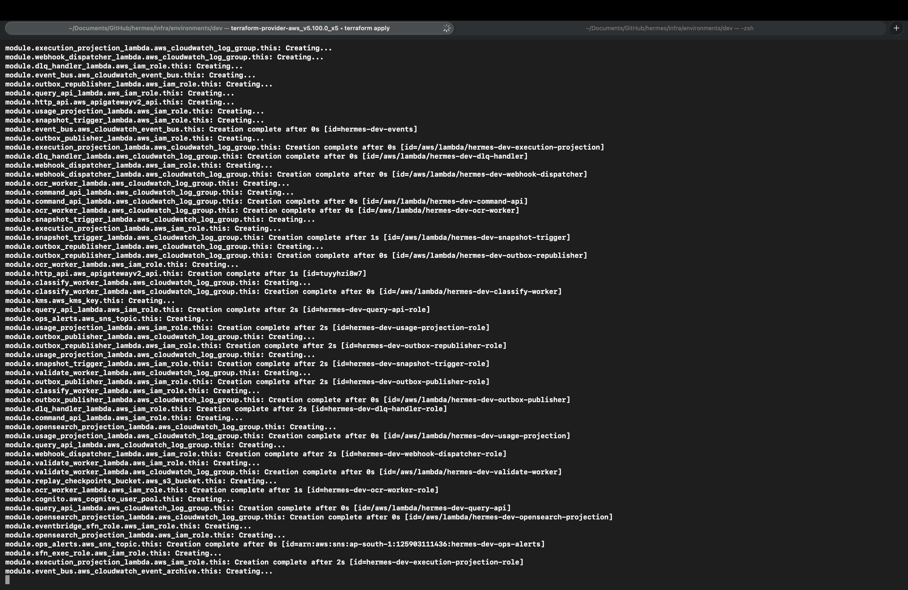

#### 3. DynamoDB Event Store & Read Model Tables
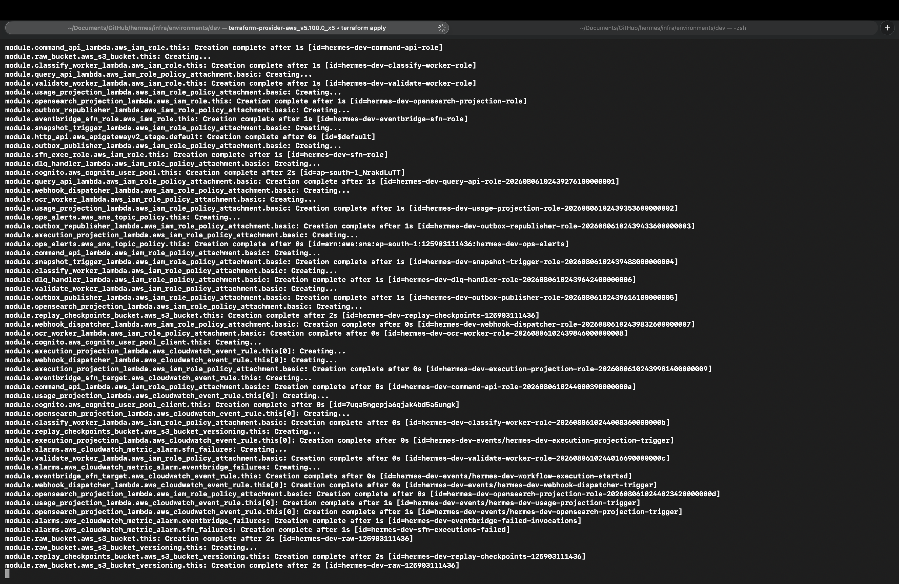

#### 4. SQS Transactional Outbox & Dead Letter Queue
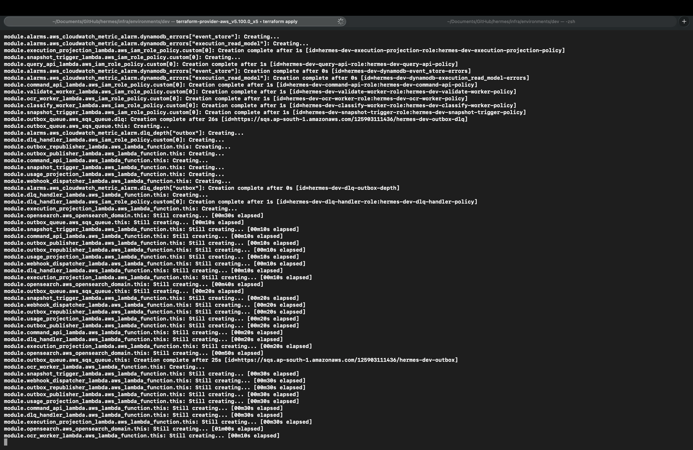

#### 5. Amazon EventBridge Event Bus & Routing Rules
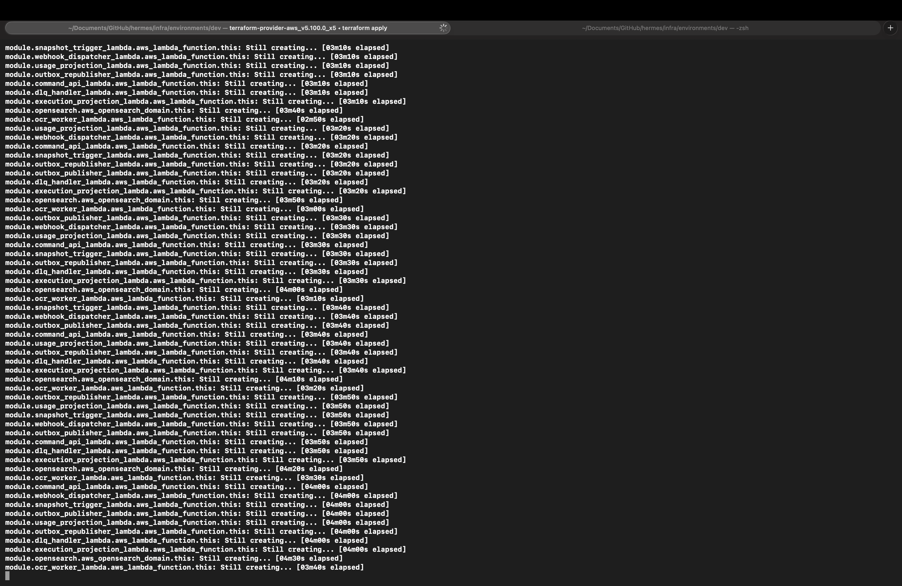

#### 6. AWS Lambda Handlers, Projections & Activity Workers
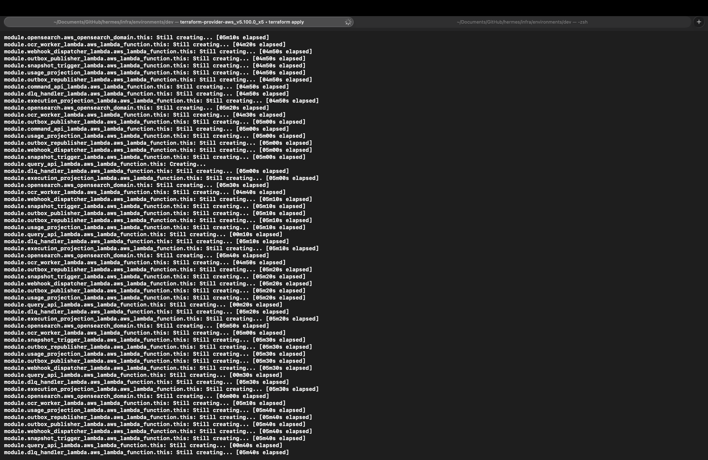

#### 7. HTTP API Gateway Routes & Cognito JWT Authorizer
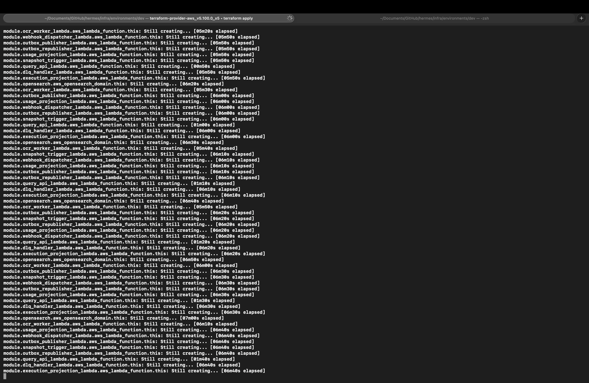

#### 8. Step Functions Workflow State Machine (`document-pipeline-v1`)
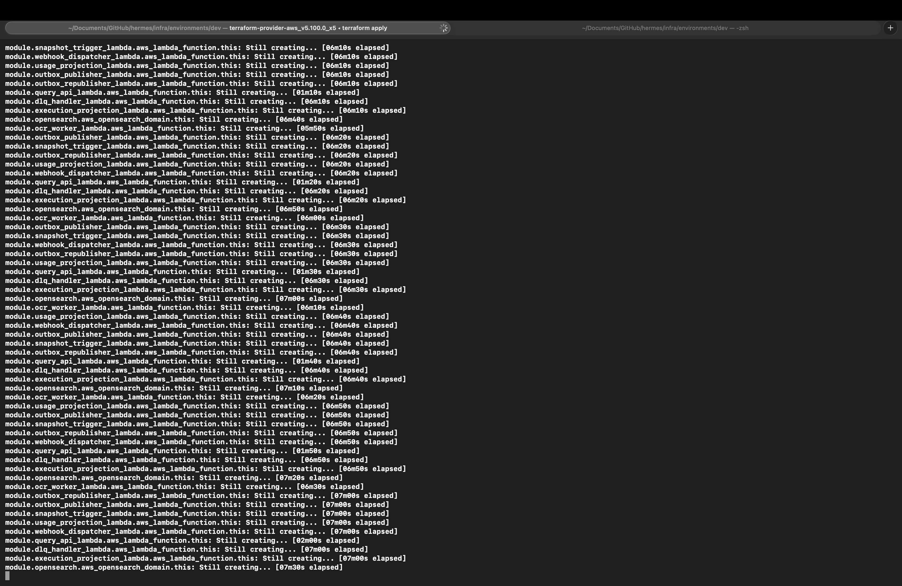

#### 9. OpenSearch Domain & Networking
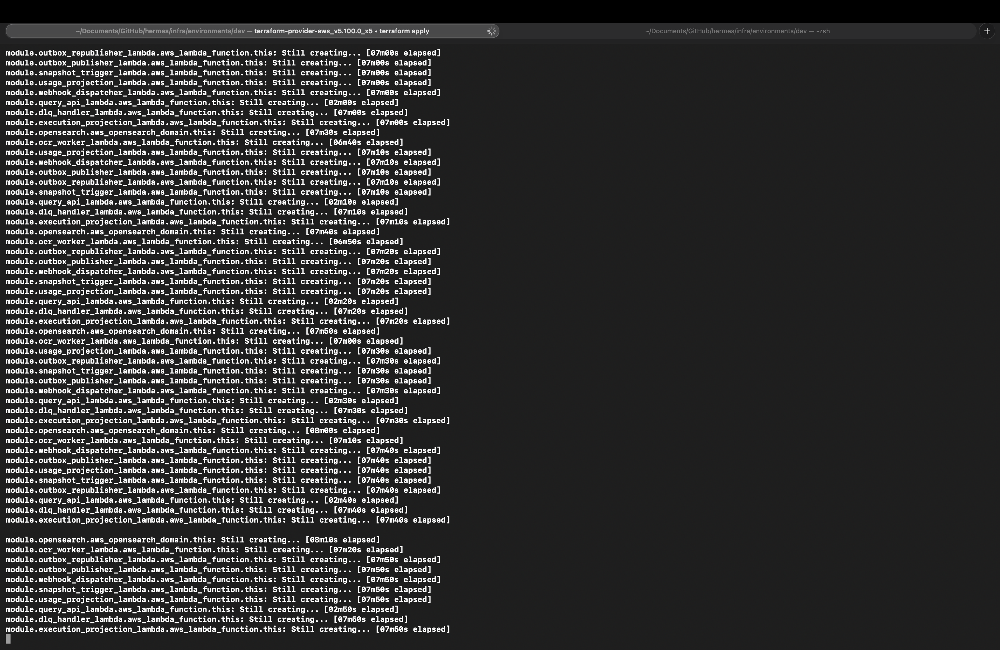

#### 10. CloudWatch Alarms & Observability Dashboard
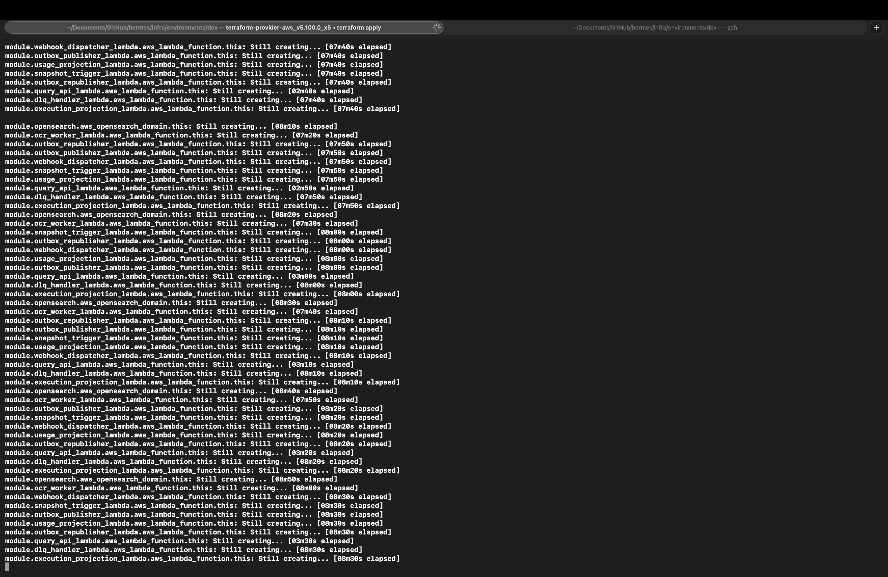

#### 11. Final Apply Output & Terraform Outputs
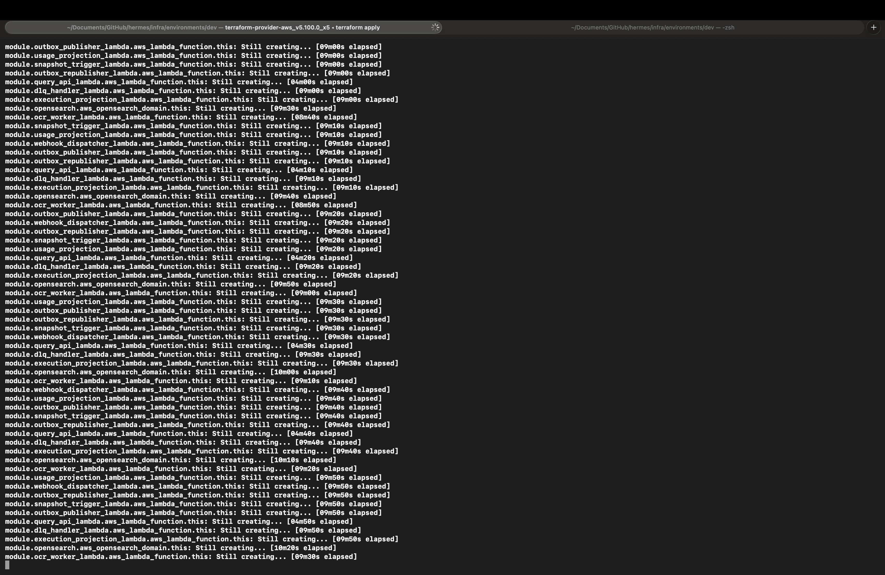
